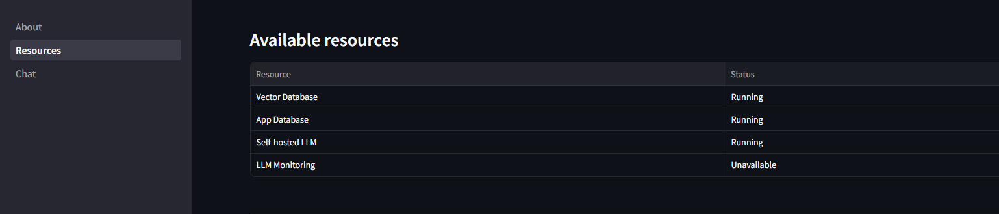
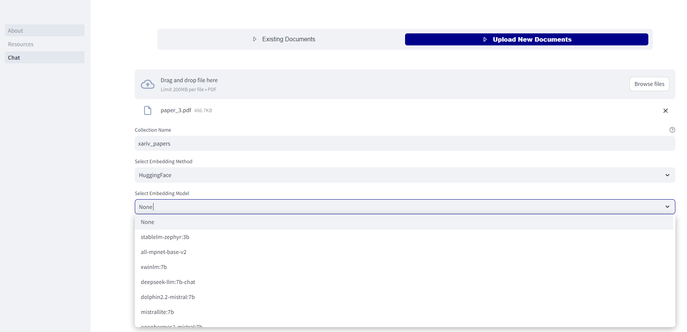
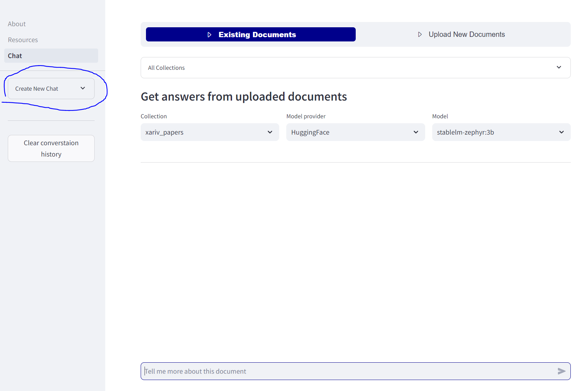
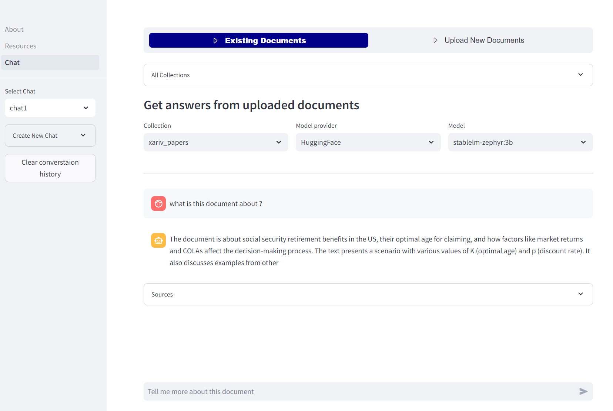

### Deployment options
- **Docker** :
    - Go to docker dir and them to cpu-only or gpu and run `docker compose up -d`
- **Kubernetes**:
    - Not yet supported

Just remember to add necessary api keys for example if you want to use OpenAI models, provide OPENAI api key in docker-compose file

### Usage

1. Check if everthing is connected correctly in **`Resources`** tab
    

 

2. Upload PDF document
    

 

3. Create new chat
    

 

4. Start Chatting, in this case using smallest possible llm (zephyr3b)
    

 

### More advanced configuration

Local LLM models inference is done using [Ollama]('https://ollama.ai/'). So any model listed in [here](https://ollama.ai/library) is supported.

 

#### Adding additional LLMs
In oder to add additional models there are some extra steps that need to be taken:

1. Update list of models in **src/app.conf** use the same model name that is written on Ollama page
2. In docker-compose.yaml uncomment section **build:** and comment section **image:**
3. Rebuild an image using `docker compose up`

 

#### Connecting app to external services

Services like
- Database (for now only Postgres is supported) - pass connection string as a DATABASE_CONN_STRING env variable
- Vectorstore (for now only Qdrant is supported) - pass database URL as QDRANT_HOST env variable
- Externally deployed LLM via Ollama - pass url as LLM_HOST env variable
